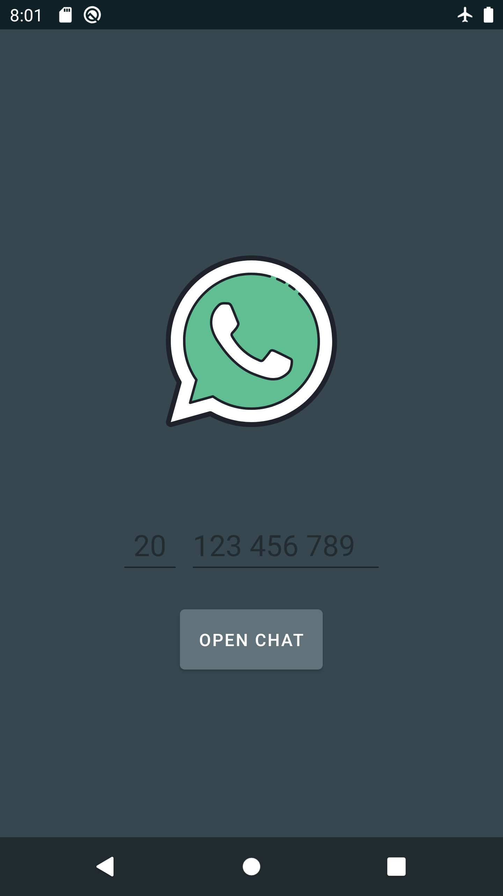

# DontSaveContacts

This is an Android app that allows users to open a WhatsApp chat directly from a WhatsApp URL using the WhatsApp API. The app is built using the MVVM architecture pattern.

# Installation

Clone the repository and open the project in Android Studio. Connect your Android device to your computer and run the app.

# Usage

- Copy the WhatsApp Number without the Country Code

- Open the app.

- Type the Country Number in the EditText.
- Paste the WhatsApp Number in the EditText.

- Click the "Open Chat"Button.

- The app will use the WhatsApp API to open the chat in the WhatsApp app on your device.

# Screenshot

# Architecture

The app is built using the MVVM architecture pattern. The ViewModel acts as a mediator between the View (the UI) and the Model (the data). When the user clicks the "Open Chat" button, the View sends a request to the ViewModel. The ViewModel then uses the WhatsApp API to open the chat in the WhatsApp app.

# Credits

This app uses the WhatsApp API to open chats. The WhatsApp API is owned by WhatsApp Inc. and is subject to their terms and conditions.

# Contributing

Contributions are always welcome! If you find a bug or have a feature request, please open an issue. If you'd like to contribute code, please open a pull request.
